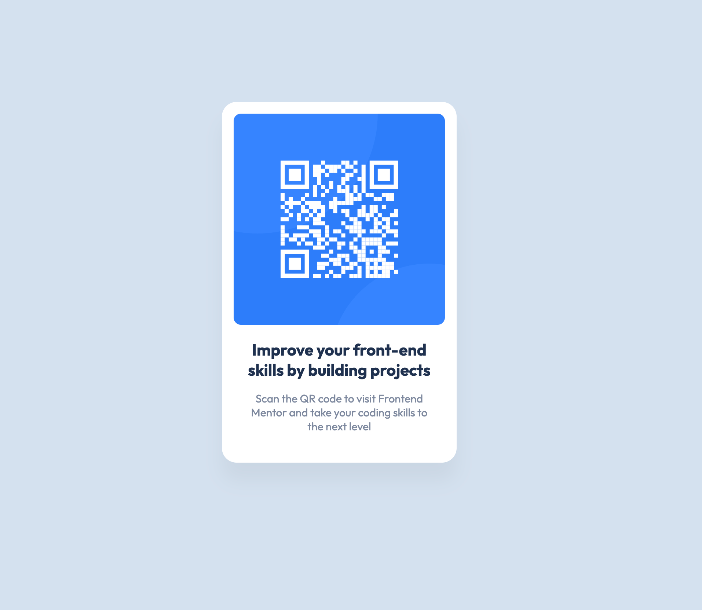

# Frontend Mentor - QR code component solution

This is a solution to the [QR code component challenge on Frontend Mentor](https://www.frontendmentor.io/challenges/qr-code-component-iux_sIO_H). Frontend Mentor challenges help you improve your coding skills by building realistic projects. 

## Table of contents

- [Overview](#overview)
  - [Screenshot](#screenshot)
  - [Links](#links)
- [My process](#my-process)
  - [Built with](#built-with)
  - [What I learned](#what-i-learned)
  - [Continued development](#continued-development)
  - [Useful resources](#useful-resources)
- [Author](#author)
- [Acknowledgments](#acknowledgments)

## Overview

### Screenshot

### Links

- Solution URL: [Add solution URL here](https://www.frontendmentor.io/solutions/qr-code-challenge-htmlcss-SywRkLFIq)
- Live Site URL: [Add live site URL here](https://samhemingway.github.io/qr-code-component-main/)

## My process

- Downloaded Figma file so I could verify margins/padding etc. Added important info to  for quick reference.
- Determined the structure of components required and determined the html elements to use for targetting with CSS.
- Built the HTML file according to the determined structure.
- Styled with CSS.
- Spent far too long figuring out how to centre vertically (details in ### What I learned).
- Checked against Safari/Chrome and mobile Safari for browser compatibility issues.
- Cross-referenced against Figma file (at this point, realised that the h1 tag wasn't coloured properly).
- Commit!

### Built with

- Semantic HTML5 markup
- CSS custom properties

### What I learned

- Wasn't expecting that centering vertically would be such a ball-ache, first time doing it. Took me some time to wrap my head around using negative margins to make it work. Learned that you need to take into account the padding of the element when calculating the negative margins using this technique the hard way ("why won't you fucking work?" — me).
- When building the container, I initially set the width attribute to be the exact width shown in the Figma file (320px). Didn't work: After the left/right padding was taken into account, the container ended up being too wide. Simply reduced the width property to compensate (most likely a hacky solution and there's a better way to do it that I'll learn in the future).
- How to actually use git!

### Continued development

Use this section to outline areas that you want to continue focusing on in future projects. These could be concepts you're still not completely comfortable with or techniques you found useful that you want to refine and perfect.

**Note: Delete this note and the content within this section and replace with your own plans for continued development.**

### Useful resources

- (https://css-tricks.com/centering-css-complete-guide/) - Helped me understand centering vertically via CSS.
- I would have normally expected to include guides here on how to create rounded corners and drop shadows with CSS, but I figured out how to get this info straight from Figma. Not sure if this is good practice or not — should learn it from a guide anyways to increase understanding.

## Author

- Website - [Sam Hemingway](https://www.linkedin.com/in/sam-hemingway/)
- Frontend Mentor - [@SamHemingway](https://www.frontendmentor.io/profile/SamHemingway)

### Acknowledgements

- Thanks to [@FluffyKas](https://www.frontendmentor.io/profile/FluffyKas) for helping me find a less hacky way of vertically centering an element!